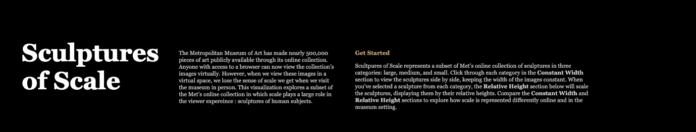
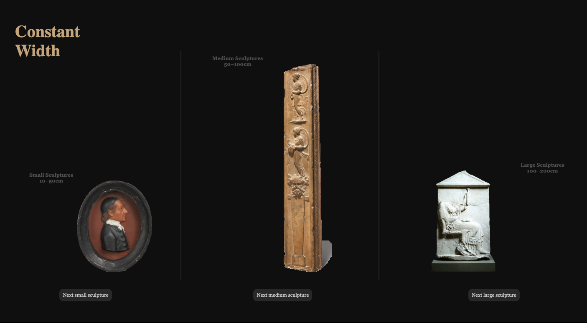
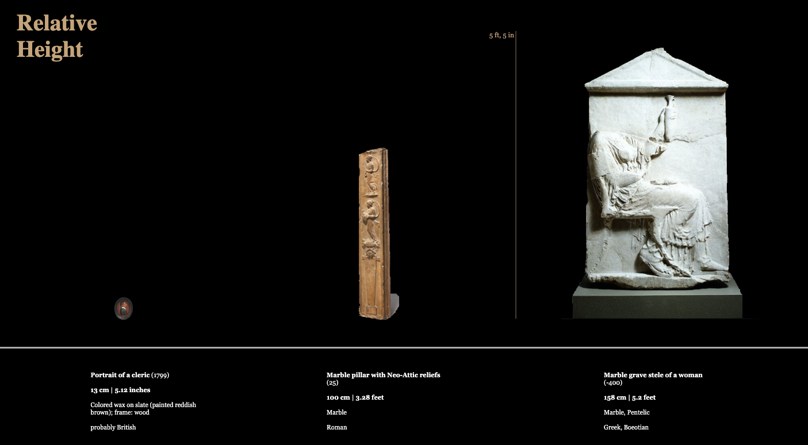
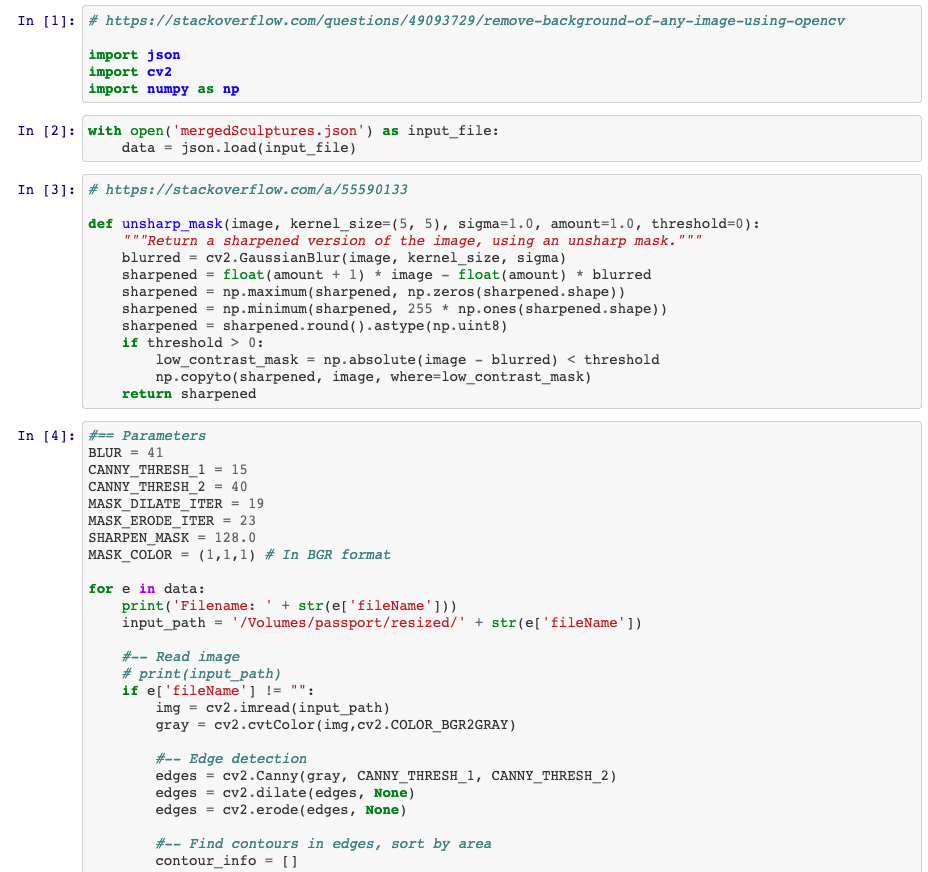

# Met Sculptures Qualitative Project Documentation
Parsons Masters in Data Visualization | Major Studio 1




[See interactive visualization here](https://marisaruizasari.github.io/Met_sculptures_qual/)

## Step 1: Object IDs from Quantitative Project & MET csv

## Step 2: MET API request image urls & download images

## Step 3: Merge image urls with original array of sculpture objects

Created a new json file (finalyClippedFileAndHeight.json) that had all sculpture objects with additonal link to image.

## Step 4: Clip images using OpenCV

See bgrmv.ipynb, ran using jupyter notebook


## Step 5: Clean & manually crop images

Manually excluded images of sculptures that did not work with the OpenCV clipping script (images that were only partially clipped or were not clipped at all). I also manually cropped any photos that were clipped enough to be usable but had additional space at the top or bottom that needed to be removed in order to map the correct height.

## Step 6: Write script

See sculptures2.js for full script

### Change image on click

Select html elements where scaled images will go:

```javascript
// scaled images
let mainSmall = document.querySelector(".mainSmallImage");
console.log(mainSmall);

let myImageMedium = document.querySelector(".mainMediumImage");
console.log(myImageMedium);

let myImageLarge = document.querySelector(".mainLargeImage");
console.log(myImageLarge);
```

Create function to change element attributes onClick (example for small sculptures):

```javascript
function changeSmall(){
 imageIndex++;

 mainSmall.setAttribute("src", "resized_clipped_tranparent_png/" + smallSculptures[imageIndex].fileNamePNG);
 overviewSmall.setAttribute("src", "resized_clipped_tranparent_png/" + smallSculptures[imageIndex].fileNamePNG);

 mainSmall.style.height = baseHeight * smallSculptures[imageIndex].height + 'px';
 overviewSmall.style.maxWidth = overviewWidth;
 overviewSmall.style.height = 'auto';

 smallOverviewDescription
 .html(`<b>${smallSculptures[imageIndex].Title}</b> (${smallSculptures[imageIndex].endDate})<br/><br/><b>${smallSculptures[imageIndex].height} cm | ${(smallSculptures[imageIndex].height * 0.393701).toFixed(2)} inches</b><br/><br/>${smallSculptures[imageIndex].Medium}<br/><br/>${smallSculptures[imageIndex].Culture}`)
 .attr('class', 'sculptureDescriptionSmall');


 if (imageIndex > smallSculptures.length) {
   imageIndex = 0;
 }
}
```

### Create sculpture height groups

```javascript
let extraSmallSculptures = [];
let smallSculptures = [];
let mediumSculptures = [];
let largeSculptures = [];
let extraLargeSculptures = [];

// loop through sculpture objects and categorize (add group to clipped sculptures objects, and also push to array for each category)
clippedSculptures.forEach(sculpture => {
 if (sculpture.height <= 10) {
  sculpture.group = "extraSmall";
  extraSmallSculptures.push(sculpture);
 } else if (sculpture.height > 10 && sculpture.height <= 50) {
  sculpture.group = "small"
  smallSculptures.push(sculpture);
 } else if (sculpture.height > 50 && sculpture.height <= 100) {
  sculpture.group = "medium";
  mediumSculptures.push(sculpture);
 } else if (sculpture.height > 100 && sculpture.height <=200) {
  sculpture.group = "large";
  largeSculptures.push(sculpture);
 } else {
  sculpture.group = "extraLarge";
  extraLargeSculptures.push(sculpture);
 }
});
```

### Map images to sculpture height

## Styling
